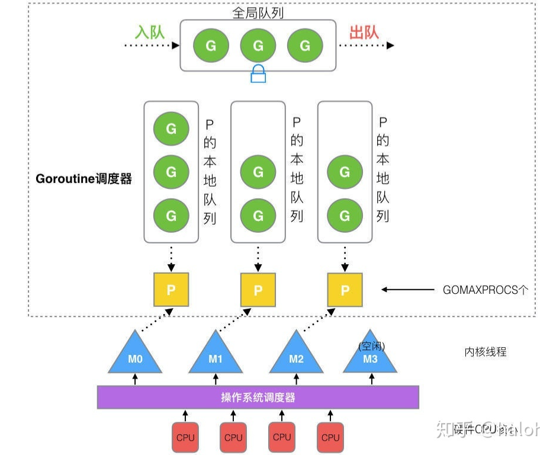
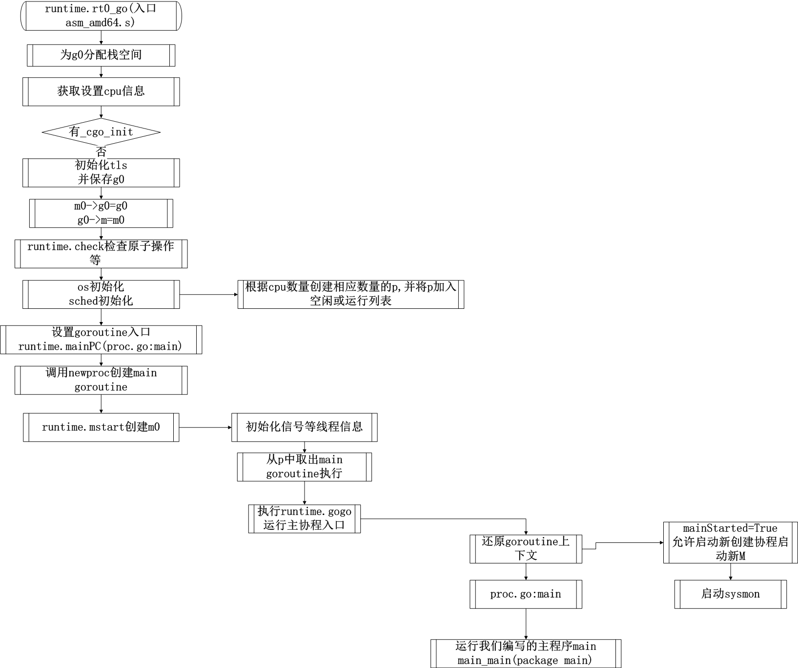
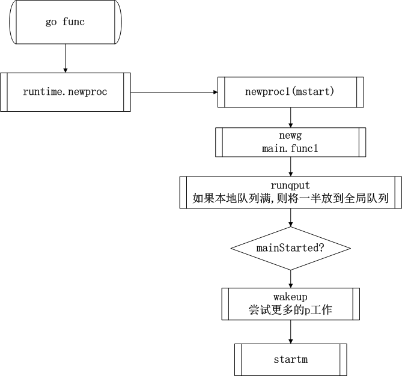

# golang程序启动流程详解

## 环境

#### go1.16.5 linux/amd64


## 用例

```golang
package main

import "fmt"

func main() {
        fmt.Println(42)
}
```

### 编译

#### -gcflags "-N -l": 关闭优化和内联,方便调试跟踪
```shell
$ go build -gcflags "-N -l" -o hello hello.go 
```

### gdb跟踪执行流程

```shell
$ gdb hello

$ source /usr/lib/go/src/runtime/runtime-gdb.py # 加载Go运行时支持
```

#### 预备知识:

##### 1. GMP调度模型

+ Golang的调度器模型是"GMP"模型,P作为逻辑cpu的抽象,解决了竞争全局队列等问题.  
+ M是操作系统线程,M必须关联到某个P上,从P上获取工作goroutine  
+ 一个P可能有多个M,当某个M阻塞时.



##### 2. runtime/proc.go中定义了一些重要的全局符号,下面分析启动流程会涉及这些符号:

```golang
var (
	m0           m // 第一个m
	g0           g // 第一个goroutine
	mcache0      *mcache // m0的cache
	raceprocctx0 uintptr // 用于竞争检测
)
```

+  g0: 主线程上的第一个协程g0, g0拥有这个线程的系统栈,这个栈很大.g0还有创建新协程的职责,当我们调用go func创建新协程都会在g0的栈上执行.
+  m0: 第一个工作线程,主线程
+  mcache0: m0的cache

##### 3. tls线程私有存储

每个线程的私有存储空间,golang主要用其来设置每个m当前正在运行的goroutine,这样可以快速获取到当前上下文的goroutine. 类似于linux内核中的current宏.

##### 4. sched全局结构

golang使用一个全局schedt结构来控制全局调度(runtime2.go),里面主要的信息如全局运行队列,所有m,所有p的状态信息,系统监控sysmon等

```golang
var (
	allm       *m
	gomaxprocs int32
	ncpu       int32
	forcegc    forcegcstate
	sched      schedt
	newprocs   int32

	// allpLock protects P-less reads and size changes of allp, idlepMask,
	// and timerpMask, and all writes to allp.
	allpLock mutex
	// len(allp) == gomaxprocs; may change at safe points, otherwise
	// immutable.
	allp []*p
```
#### 程序入口函数:

+ 为g0分配栈空间

```golang
runtime.asm_amd64.s:89

TEXT runtime·rt0_go<ABIInternal>(SB),NOSPLIT,$0
	// copy arguments forward on an even stack
	MOVQ	DI, AX		// x64上使用rdi,rsi传递入参, di:argc si:argv
	MOVQ	SI, BX		// argv
	SUBQ	$(4*8+7), SP		// 开辟栈空间,用于存放argc, argv和两个局部变量
	ANDQ	$~15, SP  //与~15& 保障SP 16字节对齐
    MOVQ	AX, 16(SP) // 存储argc, argv
	MOVQ	BX, 24(SP) // 

    MOVQ	$runtime·g0(SB), DI // 将g0存储到DI寄存器
	LEAQ	(-64*1024+104)(SP), BX //　为g0开辟64kb栈空间
	MOVQ	BX, g_stackguard0(DI)  // 将栈底地址保存到g0->stackguard0
	MOVQ	BX, g_stackguard1(DI)
	MOVQ	BX, (g_stack+stack_lo)(DI) // 将栈底保存到g0->stack->lo
	MOVQ	SP, (g_stack+stack_hi)(DI) // 将栈顶保存到g0->stack->hi

// 下面是g0的结构:
type g struct {
	// Stack parameters.
	// stack describes the actual stack memory: [stack.lo, stack.hi).
	// stackguard0 is the stack pointer compared in the Go stack growth prologue.
	// It is stack.lo+StackGuard normally, but can be StackPreempt to trigger a preemption.
	// stackguard1 is the stack pointer compared in the C stack growth prologue.
	// It is stack.lo+StackGuard on g0 and gsignal stacks.
	// It is ~0 on other goroutine stacks, to trigger a call to morestackc (and crash).
	stack       stack   // offset known to runtime/cgo
	stackguard0 uintptr // offset known to liblink
	stackguard1 uintptr // offset known to liblink
```

+ 获取cpu相关信息

```golang
	// find out information about the processor we're on
	MOVL	$0, AX  // 获取CPUID信息
	CPUID
	MOVL	AX, SI // 我本机获取到的cpuid为0xd
	CMPL	AX, $0 //判断是否获取到了cpuid,成功
	JE	nocpuinfo

	// 判断cpu的型号,并设置标志,如是否是intel.
    // 主要是需要确定RDTSC的获取方式,即cpu时间戳计数器
	CMPL	BX, $0x756E6547  // "Genu" 正式版 o
	JNE	notintel
	CMPL	DX, $0x49656E69  // "ineI"
	JNE	notintel
	CMPL	CX, $0x6C65746E  // "ntel"
	JNE	notintel
	MOVB	$1, runtime·isIntel(SB) //is inel
	MOVB	$1, runtime·lfenceBeforeRdtsc(SB) //

    ...
```

+ 初始化tls,设置m->g0, g0->m,初始化sched信息

```golang
    MOVQ	_cgo_init(SB), AX // 查看是否有_cgo_init,如果有则需要调用,我们的例子中没有_cgo_init
	TESTQ	AX, AX
	JZ	needtls //设置tls

    ...
    LEAQ	runtime·m0+m_tls(SB), DI //获取m0中的tls结构
	CALL	runtime·settls(SB) // 调用sys_linux_amd64.s:658来设置tls, linux上设置tls主要是通过arch_pcrtl实现,设置当前线程的FS信息.

	// store through it, to make sure it works
	get_tls(BX)  //下面代码主要测试tls是否正确工作.
	MOVQ	$0x123, g(BX)
	MOVQ	runtime·m0+m_tls(SB), AX
	CMPQ	AX, $0x123
	JEQ 2(PC)
	CALL	runtime·abort(SB)

    ...
    	// set the per-goroutine and per-mach "registers"
	get_tls(BX)
	LEAQ	runtime·g0(SB), CX // 将g0保存到tls中
	MOVQ	CX, g(BX) // save g0 to tls
	LEAQ	runtime·m0(SB), AX // ax -->m0

	// save m->g0 = g0
	MOVQ	CX, m_g0(AX) //将g0保存到m0中
	// save m0 to g0->m
	MOVQ	AX, g_m(CX) // 将m0设置到g0中

    CLD				// convention is D is always left cleared
	CALL	runtime·check(SB) //runtime1.go:137 检查一些cas和原子操作工作是否正确

	MOVL	16(SP), AX		// 获取之前保存到栈中的argc, argv
	MOVL	AX, 0(SP)
	MOVQ	24(SP), AX		// copy argv
	MOVQ	AX, 8(SP)
	CALL	runtime·args(SB) //runtime1.go:61 设置argc, argv到全局变量runtime1.argc, runtime1.argv
	CALL	runtime·osinit(SB) //301 os初始化,根据cpu亲和性获取可用cpu个数,获取大页信息
	CALL	runtime·schedinit(SB) //600　sched初始化,这是一个go函数,先来看一下。
```

```golang
type m struct {
	g0      *g     // goroutine with scheduling stack
    ...
	tls           [6]uintptr   // thread-local storage (for x86 extern register)
```

##### sched初始化

sched内容比较多,我们详细来看一下:

```golang
	_g_ := getg()  //　获取当前的goroutine, 之前已经保存在tls中了,getg就是从tls中获取
	if raceenabled {
		_g_.racectx, raceprocctx0 = raceinit()
	}

	sched.maxmcount = 10000 //设置最大m线程个数为10000

	// The world starts stopped.
	worldStopped()

    stackinit() // 栈缓存初始化,golang运行时需要分配栈时优先使用缓存
	mallocinit() // 内存管理初始化
	fastrandinit() // must run before mcommoninit, 快速随机数初始化
	mcommoninit(_g_.m, -1) // m初始化并将其放到全局allm链表中
	cpuinit()       // must run before alginit, cpu初始化
	alginit()       // maps must not be used before this call
	modulesinit()   // provides activeModules
	typelinksinit() // uses maps, activeModules
	itabsinit()     // uses activeModules

	sigsave(&_g_.m.sigmask) // 保存当前信号掩码到m
	initSigmask = _g_.m.sigmask

	goargs()
	goenvs()
	parsedebugvars()
	gcinit()  // 初始化gc

	lock(&sched.lock)
	sched.lastpoll = uint64(nanotime())
	procs := ncpu
	if n, ok := atoi32(gogetenv("GOMAXPROCS")); ok && n > 0 { //环境变量是否设置了GOMAXPROCS
		procs = n
	}
	if procresize(procs) != nil {  // 重新调整p的数量.
		throw("unknown runnable goroutine during bootstrap")
	}
	unlock(&sched.lock)

	// World is effectively started now, as P's can run.
	worldStarted()

    ...
```

##### sched初始化就完成了,主要就是一些全局信息,包括内存,栈缓存,P的个数,gc等.  
再回到汇编:

+ 设置主协程入口函数runtime.mainPC,调用newproc创建主协程

```asm
	CALL	runtime·schedinit(SB) //600

	// create a new goroutine to start program
	MOVQ	$runtime·mainPC(SB), AX		// 新goroutine的入口函数
	PUSHQ	AX          // 压入栈中下面传递给newproc
	PUSHQ	$0			// arg size
	CALL	runtime·newproc(SB) // 创建新的p,这也是一个go函数,重点分析一下.
	POPQ	AX
	POPQ	AX

	// start this M
	CALL	runtime·mstart(SB) //mstart loop

	CALL	runtime·abort(SB)	// mstart should never return
	RET
```

##### newproc:

+ 创建主协程并将其放到p的本地队列中,systemstack函数表示在系统栈上执行goroutine的创建操作

```golang
	argp := add(unsafe.Pointer(&fn), sys.PtrSize) // 获取argp
	gp := getg() // 获取当前goroutine
	pc := getcallerpc()
	systemstack(func() {  // 调用systemstack来执行
		newg := newproc1(fn, argp, siz, gp, pc)

		_p_ := getg().m.p.ptr()
		runqput(_p_, newg, true)

		if mainStarted {
			wakep()
		}
	})
```

##### systemstack

```asm
TEXT runtime·systemstack(SB), NOSPLIT, $0-8
	MOVQ	fn+0(FP), DI	// DI = fn, 将要执行的函数指针放到rdi.
	get_tls(CX)  // 获取当前goroutine
	MOVQ	g(CX), AX	// AX = g, g0
	MOVQ	g_m(AX), BX	// BX = m, m0

	CMPQ	AX, m_gsignal(BX)　//判断当前goroutine是否是用于处理信号的goroutine
	JEQ	noswitch

	MOVQ	m_g0(BX), DX	// DX = g0
	CMPQ	AX, DX // 判断当前goroutine是否是当前栈的使用者
	JEQ	noswitch // 如果是则不需要切换栈,　这里明显是,因此直接跳转到noswitch

	CMPQ	AX, m_curg(BX)
	JNE	bad

noswitch:
	// already on m stack; tail call the function
	// Using a tail call here cleans up tracebacks since we won't stop
	// at an intermediate systemstack.
	MOVQ	DI, DX
	MOVQ	0(DI), DI // di是之前传递给systemstack的fn
	JMP	DI // 执行fn
```

```golang
	systemstack(func() {
		newg := newproc1(fn, argp, siz, gp, pc) //创建新goroutine执行fn

		_p_ := getg().m.p.ptr()
		runqput(_p_, newg, true)

		if mainStarted {
			wakep()
		}
	})
```

##### newproc1:

newproc1的作用是为执行函数分配新的goroutine

```golang
func newproc1(fn *funcval, argp unsafe.Pointer, narg int32, callergp *g, callerpc uintptr) *g {
	_g_ := getg() // 获取当前g

	if fn == nil {
		_g_.m.throwing = -1 // do not dump full stacks
		throw("go of nil func value")
	}
	acquirem() // 锁定m,禁止抢占
	siz := narg
	siz = (siz + 7) &^ 7

    _p_ := _g_.m.p.ptr() // 获取当前的p
	newg := gfget(_p_) //　查找是否有缓存的goroutine,这些goroutine是dead状态的,可以直接使用的.如果本地没有还会从全局查找,最后都没有才会真的申请新的goroutine 

    if newg == nil { // 当前没有可重复使用的缓存gorutine
        newg = malg(_StackMin) // 申请新的goroutine
        casgstatus(newg, _Gidle, _Gdead) // 初始状态为Gdead.
        allgadd(newg) // 将newg加入全局allg
	}

    /*为newg 准备栈和参数*/
    totalSize := 4*sys.RegSize + uintptr(siz) + sys.MinFrameSize // extra space in case of reads slightly beyond frame
	totalSize += -totalSize & (sys.SpAlign - 1)                  // align to spAlign
	sp := newg.stack.hi - totalSize
	spArg := sp
	if usesLR {
		// caller's LR
		*(*uintptr)(unsafe.Pointer(sp)) = 0
		prepGoExitFrame(sp)
		spArg += sys.MinFrameSize
	}

    ...
    /*设置newg的sp, pc, g, startpc等　信息*/
    newg.sched.sp = sp
	newg.stktopsp = sp
	newg.sched.pc = funcPC(goexit) + sys.PCQuantum // +PCQuantum so that previous instruction is in same function
	newg.sched.g = guintptr(unsafe.Pointer(newg))
	gostartcallfn(&newg.sched, fn)
	newg.gopc = callerpc
	newg.ancestors = saveAncestors(callergp)
	newg.startpc = fn.fn

    casgstatus(newg, _Gdead, _Grunnable) // 修改newg状态为runnable

	if _p_.goidcache == _p_.goidcacheend {
		// Sched.goidgen is the last allocated id,
		// this batch must be [sched.goidgen+1, sched.goidgen+GoidCacheBatch].
		// At startup sched.goidgen=0, so main goroutine receives goid=1.
		_p_.goidcache = atomic.Xadd64(&sched.goidgen, _GoidCacheBatch)
		_p_.goidcache -= _GoidCacheBatch - 1
		_p_.goidcacheend = _p_.goidcache + _GoidCacheBatch
	}
	newg.goid = int64(_p_.goidcache) //　设置goroutie id.
	_p_.goidcache++

    ...
```

创建好新的goroutine后,继续:

```golang
	systemstack(func() {
		newg := newproc1(fn, argp, siz, gp, pc) //创建新goroutine执行fn

		_p_ := getg().m.p.ptr() // 获取新routine的p.
		runqput(_p_, newg, true) // 将新routine放入运行队列. 首先尝试放入本地队列,如果本地队列满则放入全局队列.本地队列最大256.

		if mainStarted {
			wakep()
		}
	})
```

##### 新goroutine创建完成,再启动一个m,这个m目前是主线程,即m0

```asm
	CALL	runtime·newproc(SB)
	POPQ	AX
	POPQ	AX

	// start this M
	CALL	runtime·mstart(SB) //调用mstart启动m

	CALL	runtime·abort(SB)	// mstart should never return
	RET
```

##### 初始化m0,设置线程id

```golang
func minit() {
	minitSignals() // 初始化信号处理,设置信号处理栈和掩码

	// Cgo-created threads and the bootstrap m are missing a
	// procid. We need this for asynchronous preemption and it's
	// useful in debuggers.
	getg().m.procid = uint64(gettid()) //设置m的procid,即线程id
}
```

+ m0,g0都初始化完成后就开始执行主协程,这时通过汇编代码gogo执行主协程

```golang
TEXT runtime·gogo(SB), NOSPLIT, $16-8
	MOVQ	buf+0(FP), BX		// gobuf
	MOVQ	gobuf_g(BX), DX
	MOVQ	0(DX), CX		// make sure g != nil
	get_tls(CX)
	MOVQ	DX, g(CX)
	MOVQ	gobuf_sp(BX), SP	// restore SP
	MOVQ	gobuf_ret(BX), AX
	MOVQ	gobuf_ctxt(BX), DX
	MOVQ	gobuf_bp(BX), BP
	MOVQ	$0, gobuf_sp(BX)	// clear to help garbage collector
	MOVQ	$0, gobuf_ret(BX)
	MOVQ	$0, gobuf_ctxt(BX)
	MOVQ	$0, gobuf_bp(BX)
	MOVQ	gobuf_pc(BX), BX // 执行之前的runtime.mainPC,即主协程入口
	JMP	BX
```

+ 执行主协程入口proc.go: main

主协程会启动sysmon线程进行监控,然后执行package main里我们实现的main函数

```golang
...
	mainStarted = true // 设置main开始标志,这样才允许新协程启动新的M.

	if GOARCH != "wasm" { // no threads on wasm yet, so no sysmon
		// For runtime_syscall_doAllThreadsSyscall, we
		// register sysmon is not ready for the world to be
		// stopped.
		atomic.Store(&sched.sysmonStarting, 1)
		systemstack(func() {
			newm(sysmon, nil, -1) // 启动sysmon
		})

...
	fn := main_main // 执行package main中主函数
	fn()
```

上面就是一个go程序的启动流程,总结一下:




### 我们再来分析一下调用go func创建协程的流程



+ go func关键字会被编译器转换为runtime.newproc调用创建新协程
+ 新协程加入当前p的本地队列
+ 如果本地队列已满,则批量将一半的goroutine放入全局队列
+ 之前主协程已经设置了mainStarted标志,因此会调用wakeup尝试唤醒更多空闲的p来工作