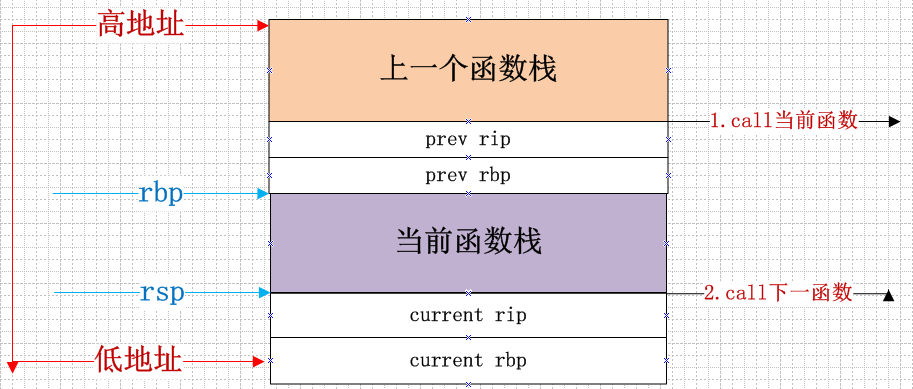
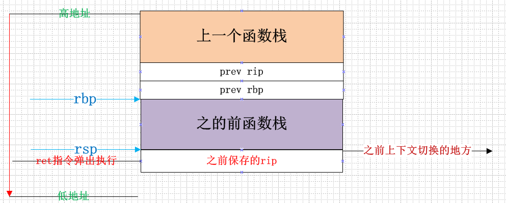
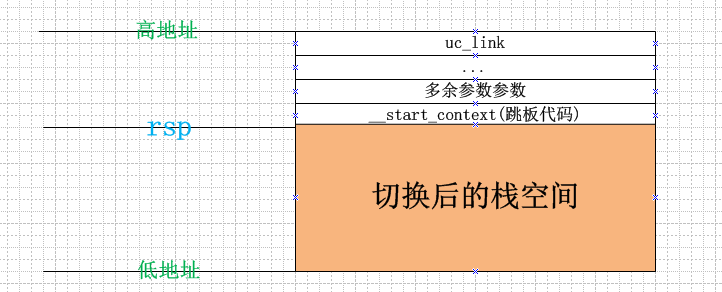

# 协程切换原理

## 使用glibc中<ucontext.h>提供的相关函数

用户态切换简单来说就是保存当前上下文,切换到新的上下文.  
用户态程序的上下文一般包含如下信息:

+ 栈
+ 各种寄存器
+ 信号掩码: linux信号掩码是基于线程的,协程也需要支持单独设置信号掩码信息

我们来看一下glibc定义的用户态上下文结构ucontext_t:

```C
typedef struct ucontext_t
  {
    unsigned long int __ctx(uc_flags);
    struct ucontext_t *uc_link; // 链接下一个ucontext_t,当前上下文结束后自动切换到这个上下文,用于被动切换
    stack_t uc_stack; // 当前上下文的栈信息, 24字节
    mcontext_t uc_mcontext; // 当前上下文的通用寄存器, 23个通用寄存器,1个指向fpu结构的指针,64字节保留信息. 总共256字节
    sigset_t uc_sigmask; //当前上下文的信号掩码, 128字节
    struct _libc_fpstate __fpregs_mem; // fpu相关寄存器
    unsigned long long int __ssp[4];
  } ucontext_t; // 总共968字节
```

通过上述结构定义,我们也可以看出,用户态上下文主要就是寄存器和栈,另外还有信号掩码信息.  

### ucontext相关api实现

##### 由于ucontext api使用汇编代码实现,因此我们先来学习一些汇编基础知识.  

+ x64上使用rdi, rsi, rdx, rcx, r9, r10传递参数,如果参数大于6个则使用栈
+ leaq指令用于取地址,类似于c中的&

##### 另外为了理解如何保存当前栈和指令寄存器,我们要熟悉一下x64上函数调用的相关知识:



+ 1. 当上一个函数使用call指令调用当前函数时,会将上一个函数的返回地址`prev rip`压入栈中,这样当被调用函数调用`ret`指令返回时就会从栈中`pop`出这个地址进行返回
+ 2. 当前函数执行时,会将上一级函数的`rbp`压入栈中,用于函数返回时还原,然后将`rbp`设置为当前的栈底,再调用`rsp`开辟当前函数的栈.
+ 3. 现在我们考虑在当前函数中调用getcontext会发生什么, 通过call调用getcontext后,当前函数的返回地址`current rip`被压入栈中:

#### 1. 保存当前上下文 

getcontext能够将当前的上下文信息保存起来,用于后面还原.我们来看下具体实现:

##### 函数原型

```C
int getcontext(ucontext_t *ucp);
```

##### 函数详解

```asm
ENTRY(__getcontext)
	/* Save the preserved registers, the registers used for passing
	   args, and the return address.  */
	movq	%rbx, oRBX(%rdi) // rdi即为每一个函数参数,即我们传递的ucontext_t
	movq	%rbp, oRBP(%rdi)
	movq	%r12, oR12(%rdi)
	movq	%r13, oR13(%rdi)
	movq	%r14, oR14(%rdi)
	movq	%r15, oR15(%rdi)

	movq	%rdi, oRDI(%rdi)
	movq	%rsi, oRSI(%rdi)
	movq	%rdx, oRDX(%rdi)
	movq	%rcx, oRCX(%rdi)
	movq	%r8, oR8(%rdi)
	movq	%r9, oR9(%rdi)  // 保存所有的通用寄存器到ucontext_t中

	movq	(%rsp), %rcx // 
	movq	%rcx, oRIP(%rdi)  // 通过上述分析,我们知道当前rsp里保存的是函数的返回地址,将其保存到ucontext_t中
	leaq	8(%rsp), %rcx		/* Exclude the return address.  */
	movq	%rcx, oRSP(%rdi)  // 将当前函数的rsp保存起来,注意这里+8是为了跳过刚才的函数返回地址.
...
	leaq	oFPREGSMEM(%rdi), %rcx  // 保存浮点计算相关寄存器
	movq	%rcx, oFPREGS(%rdi)
	/* Save the floating-point environment.  */
	fnstenv	(%rcx)
	fldenv	(%rcx)
	stmxcsr oMXCSR(%rdi)

	/* Save the current signal mask with
	   rt_sigprocmask (SIG_BLOCK
, NULL, set,_NSIG/8).  */
    /* 保存当前的信号掩码,这里通过rt_sigprocmask系统调用实现的 */
	leaq	oSIGMASK(%rdi), %rdx  // 通过rdx传递第3个参数,即ucontext中uc_sigmask的地址
	xorl	%esi,%esi // 第2个参数为NULL
#if SIG_BLOCK == 0
	xorl	%edi, %edi
#else
	movl	$SIG_BLOCK, %edi // 第一个参数为SIG_BLOCK
#endif
	movl	$_NSIG8,%r10d // 第4个参数
	movl	$__NR_rt_sigprocmask, %eax // 调用系统调用rt_sigprocmask
	syscall
	cmpq	$-4095, %rax		/* Check %rax for error.  */
	jae	SYSCALL_ERROR_LABEL	/* Jump to error handler if error.  */

	/* All done, return 0 for success.  */
	xorl	%eax, %eax // 系统调用成功返回
	ret
PSEUDO_END(__getcontext)
```

#### 2. 设置上下文: 

setcontext函数能够还原之前的ucontext_t中的状态.

##### 函数原型:

```C
int setcontext(const ucontext_t *ucp);
```

##### 实现详解:

```asm
ENTRY(__setcontext)
	/* Save argument since syscall will destroy it.  */
	pushq	%rdi  // rdi即我们传递的ucontext_t,将其保存到栈里,因为后面系统调用会破坏rdi,我们先保存起来
	cfi_adjust_cfa_offset(8) //这是汇编指令,用于实现cfi功能,与我们讨论的内容无关可以不用关心,如果感兴趣可以看下面的文章了解:
    https://stackoverflow.com/questions/51962243/what-is-cfi-adjust-cfa-offset-and-cfi-rel-offset

    https://blog.csdn.net/pwl999/article/details/107569603

	/* Set the signal mask with
	   rt_sigprocmask (SIG_SETMASK, mask, NULL, _NSIG/8).  */
    /* 设置ucontext_t中的信号掩码*/
	leaq	oSIGMASK(%rdi), %rsi    //将之前保存的信号掩码设置到rsi即rt_sigprocmask第2个参数 
	xorl	%edx, %edx
	movl	$SIG_SETMASK, %edi
	movl	$_NSIG8,%r10d
	movl	$__NR_rt_sigprocmask, %eax
	syscall
	/* Pop the pointer into RDX. The choice is arbitrary, but
	   leaving RDI and RSI available for use later can avoid
	   shuffling values.  */
	popq	%rdx                    // 还原之前保存的ucontext_t
	cfi_adjust_cfa_offset(-8)
	cmpq	$-4095, %rax		/* Check %rax for error.  */
	jae	SYSCALL_ERROR_LABEL	/* Jump to error handler if error.  */

	/* Restore the floating-point context.  Not the registers, only the
	   rest.  */
	movq	oFPREGS(%rdx), %rcx //恢复之前的浮点寄存器
	fldenv	(%rcx)
	ldmxcsr oMXCSR(%rdx)


	/* Load the new stack pointer, the preserved registers and
	   registers used for passing args.  */
	cfi_def_cfa(%rdx, 0)
	cfi_offset(%rbx,oRBX)
	cfi_offset(%rbp,oRBP)
	cfi_offset(%r12,oR12)
	cfi_offset(%r13,oR13)
	cfi_offset(%r14,oR14)
	cfi_offset(%r15,oR15)
	cfi_offset(%rsp,oRSP)
	cfi_offset(%rip,oRIP)

	movq	oRSP(%rdx), %rsp  //还原保存的rsp
	movq	oRBX(%rdx), %rbx  //还原之前保存的rbx
	movq	oRBP(%rdx), %rbp    //还原之前保存的rbp和其它通用寄存器
	movq	oR12(%rdx), %r12
	movq	oR13(%rdx), %r13
	movq	oR14(%rdx), %r14
	movq	oR15(%rdx), %r15
...
    /* The following ret should return to the address set with
	getcontext.  Therefore push the address on the stack.  */
	movq	oRIP(%rdx), %rcx //将原来保存的rip压入栈中
	pushq	%rcx

	movq	oRSI(%rdx), %rsi
	movq	oRDI(%rdx), %rdi
	movq	oRCX(%rdx), %rcx
	movq	oR8(%rdx), %r8
	movq	oR9(%rdx), %r9

	/* Setup finally %rdx.  */
	movq	oRDX(%rdx), %rdx //恢复原来的rdx

	/* End FDE here, we fall into another context.  */
	cfi_endproc
	cfi_startproc

	/* Clear rax to indicate success.  */
	xorl	%eax, %eax
	ret  //             ret指令会将之前`pushq %rcx`压入栈中的old rip弹出执行,这样就执行回之前上下文的指令了
PSEUDO_END(__setcontext)
```

下面的图示详细展示了执行setcontext后的栈布局:




#### 一个例子

下面我们通过getcontext, setcontext来实现一个示例直观理解一下:

```C
#include <stdio.h>
#include <stdlib.h>
#include <unistd.h>
#include <ucontext.h>

int main()
{
    ucontext_t uc;

    getcontext(&uc);  // 保存当前上下文
    printf("hello the world\r\n");
    sleep(1);
    setcontext(&uc); // 还原之前上下文,代码又执行到printf了.
    return 0;
}
```

执行上面代码会看到反复打印"hello the world"

```shell
安哥6@ubuntu:~$ ./a.out
hello the world
hello the world
hello the world
hello the world
hello the world
...
```

上面的两个函数只实现了简单的保存当前上下文和设置上下文的功能,要实现更复杂的协程切换,我们需要灵活地创建上下文和在两个上下文之间切换,因此`makecontext`, `swapcontext`就派上用场了:

#### 3. makecontext

makecontext能够让我们设置栈的位置,要执行的函数即要传递的参数,这样就具备了创建协程运行环境的功能.

##### 函数原型 

```C
void makecontext(ucontext_t *ucp, void (*func)(), int argc, ...);
```

+ ucp: 上下文结构
+ func: 关联的函数
+ argc: 关联的函数的参数个数
+ ...: 关联的参数

##### 函数详解

+ uc_link解释: 当我们创建的ucontext_t中的函数执行结束后,应该切换到哪里去?为了能够指明这个信息,ucontext_t中有一个uc_link指针,它指向另外一个ucontext_t结构,这就是uc_link的作用.

+ 跳板代码: (__start_context函数)  
    由跳板代码完成uc_link的加载和切换,这样ucontext_t结束时就能切换到uc_link.
    跳板代码放在ucontext_t函数栈的最顶端,这样ucontext_t结束时就能通过`ret`弹出并执行了.

```C
__makecontext (ucontext_t *ucp, void (*func) (void), int argc, ...)
...

    /* Generate room on stack for parameter if needed and uc_link.  */
    sp = (greg_t *) ((uintptr_t) ucp->uc_stack.ss_sp
        + ucp->uc_stack.ss_size);        // 首先设置sp的值,由我们传入的ucp中的sp和大小相加
    sp -= (argc > 6 ? argc - 6 : 0) + 1;      // 如果参数大于6个,则需要额外开辟栈空间,额外再加1是要为uc_link预留空间
    /* Align stack and make space for trampoline address.  */
    sp = (greg_t *) ((((uintptr_t) sp) & -16L) - 8);　    //sp字节对齐并为跳板代码预留空间.


    idx_uc_link = (argc > 6 ? argc - 6 : 0) + 1;  // 根据参数个数计算uc_link在sp中的位置

    /* Setup context ucp.  */
    /* Address to jump to.  */
    ucp->uc_mcontext.gregs[REG_RIP] = (uintptr_t) func;  //保存func地址到rip
    /* Setup rbx.*/
    ucp->uc_mcontext.gregs[REG_RBX] = (uintptr_t) &sp[idx_uc_link]; //rbx设置uc_link在sp中的地址
    ucp->uc_mcontext.gregs[REG_RSP] = (uintptr_t) sp;  //保存sp

    ...
    sp[0] = (uintptr_t) &__start_context;   //跳板代码地址,切换上下文时通过跳板代码实现
    sp[idx_uc_link] = (uintptr_t) ucp->uc_link; //存储uc_link地址

    va_start (ap, argc);

    /*下面代码是将要传递的参数保存起来*/
    for (i = 0; i < argc; ++i)
    switch (i)
      {
      case 0:
    ucp->uc_mcontext.gregs[REG_RDI] = va_arg (ap, greg_t);
    break;
      case 1:
    ucp->uc_mcontext.gregs[REG_RSI] = va_arg (ap, greg_t);
    break;
      case 2:
    ucp->uc_mcontext.gregs[REG_RDX] = va_arg (ap, greg_t);
    break;
      case 3:
    ucp->uc_mcontext.gregs[REG_RCX] = va_arg (ap, greg_t);
    break;
      case 4:
    ucp->uc_mcontext.gregs[REG_R8] = va_arg (ap, greg_t);
    break;
      case 5:
    ucp->uc_mcontext.gregs[REG_R9] = va_arg (ap, greg_t);
    break;
      default:
    /* Put value on stack.  */
    sp[i - 5] = va_arg (ap, greg_t); //大于6个参数用栈保存
    break;
      }
  va_end (ap);
```

#### 4. swapcontext

将当前上下文保存并切换到另一个上下文中

##### 函数原型

```C
    int swapcontext(ucontext_t *oucp, const ucontext_t *ucp);
```

#### 详细实现

swapcontext的前半部分和getcontext类似保存当前上下文,后半部分和setcontext类似,因此只分析关键部分

```asm
    /* Load the new stack pointer and the preserved registers.  */
	movq	oRSP(%rdx), %rsp  /*还原通用寄存器*/
	movq	oRBX(%rdx), %rbx
	movq	oRBP(%rdx), %rbp
	movq	oR12(%rdx), %r12
	movq	oR13(%rdx), %r13
	movq	oR14(%rdx), %r14
	movq	oR15(%rdx), %r15
...
	/* The following ret should return to the address set with
	getcontext.  Therefore push the address on the stack.  */
	movq	oRIP(%rdx), %rcx // 将新context_t中的rip放入栈中,这样下面的`ret`指令就会弹出并执行了
	pushq	%rcx

	/* Setup registers used for passing args.  */
	movq	oRDI(%rdx), %rdi
	movq	oRSI(%rdx), %rsi
	movq	oRCX(%rdx), %rcx
	movq	oR8(%rdx), %r8
	movq	oR9(%rdx), %r9

	/* Setup finally %rdx.  */
	movq	oRDX(%rdx), %rdx

	/* Clear rax to indicate success.  */
	xorl	%eax, %eax
	ret  // 从栈中弹出新ucontext_t的`rip`并执行
```

##### swapcontext后的栈布局



最后我们看一下当切换后的ucontext_t执行完后如何通过跳板代码执行到uc_link.

###### 跳板代码实现

```asm
ENTRY(__start_context)
	/* This removes the parameters passed to the function given to
	   'makecontext' from the stack.  RBX contains the address
	   on the stack pointer for the next context.  */
	movq	%rbx, %rsp  // 取出uc_link地址

	/* Don't use pop here so that stack is aligned to 16 bytes.  */
	movq	(%rsp), %rdi    // 将uc_link的值放入rdi,准备setcontext	
	testq	%rdi, %rdi  // 如果uc_link是NULL,则退出程序
	je	2f			/* If it is zero exit.  */

	call	__setcontext  // 调用__setcontext完成上下文设置,uc_link已放入rdi,即第一个参数.
	/* If this returns (which can happen if the syscall fails) we'll
	   exit the program with the return error value (-1).  */
	movq	%rax,%rdi

2:
	call	HIDDEN_JUMPTARGET(exit)
	/* The 'exit' call should never return.  In case it does cause
	   the process to terminate.  */
L(hlt):
	hlt
END(__start_context)

```